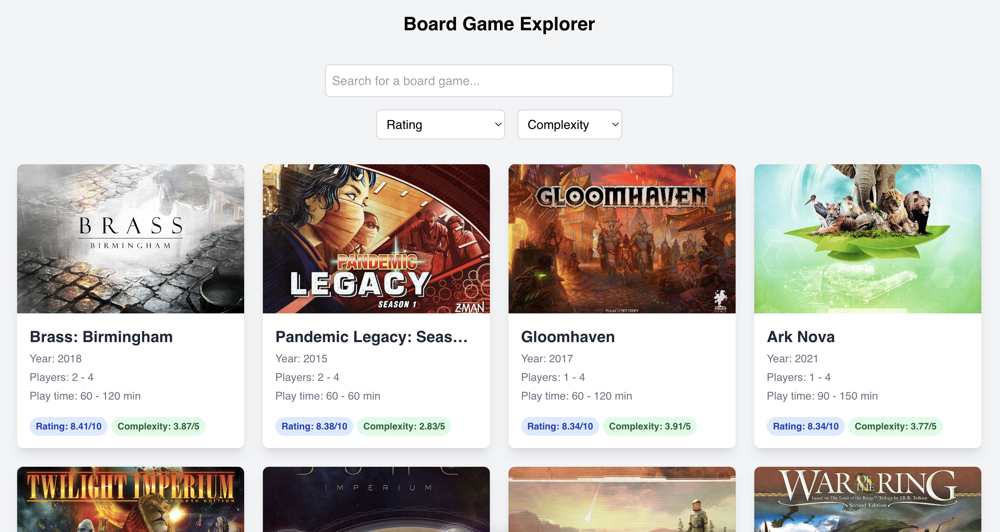

# Alpine Board Game Explorer

Alpine Board Game Explorer is a simple web application that lets you explore board games. You can search for board games, sort them by filters and view information about them.

**Demo: [alpine-board-game-explorer.vercel.app](https://alpine-board-game-explorer.vercel.app)**



## Features

- **Search:** Search for board games by name.
- **Sort:** Sort board games according to criteria such as complexity and rating.
- **View Details:** View details of a board game such as its name, image, description, complexity, rating, and number of players.
- **Local Storage:**  and search query are stored in the local storage.
- **Responsive Design**: The application is responsive and works on all devices.

## Tech Stack


- **Framework**: [Alpine.js](https://alpinejs.dev)
- **Styling**: [Tailwind CSS](https://tailwindcss.com)
- **Deployment**: [Vercel](https://vercel.com)

## Getting Started

To get started with this project, follow these steps:

1. **Clone the repository**:
    ```sh
    git clone https://github.com/zorkham/alpine-board-game-explorer.git
    ```

2. **Open in your browser**: Open the HTML file in your default browser to see the application in action.

## Other Projects

- [Alpine Markt](https://github.com/Zorkham/alpine-markt)
- [Alpine Password Manager](https://github.com/Zorkham/alpine-password-manager)
- [Alpine Pokedex](https://github.com/Zorkham/alpine-pokedex)
